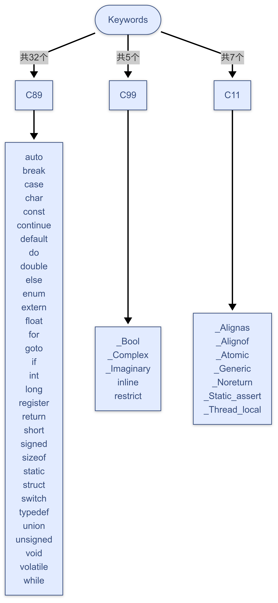

# 一、什么是Token
和数据一样，Token是最基本的文本单元。这一步没有任意含义，只是传入后续的语法解析！

# 二、Token的类型

关键字（Keywords）

标识符（Identifiers）

常量（Constants）

字符串字面量（String Literals）

运算符（Operators）

分隔符（Separators）

# 三、C语言的关键字
C语言的关键字共32个，分为C89、C99、C11三个版本。

---

