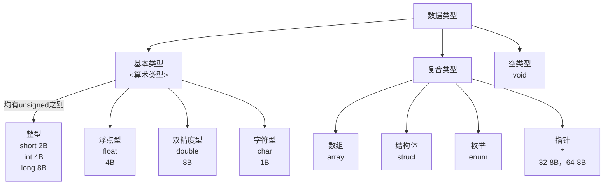

# 一、共3类

```mermaid
graph TB 
dataType[数据类型]
basic[基本类型<br><算术类型>]
complex[复合类型]
void[空类型<br>void]
dataType-->basic
dataType-->complex
dataType-->void

basic--均有unsigned之别-->int[整型<br>short 2B<br>int 4B<br>long 8B]
basic-->float[浮点型<br>float<br>4B]
basic-->double[双精度型<br>double<br>8B]
basic-->char[字符型<br>char<br>1B]

complex-->array[数组<br>array]
complex-->struct[结构体<br>struct]
complex-->enum[枚举<br>enum]
complex-->pointer[指针<br>*<br>32-8B，64-8B]

```
