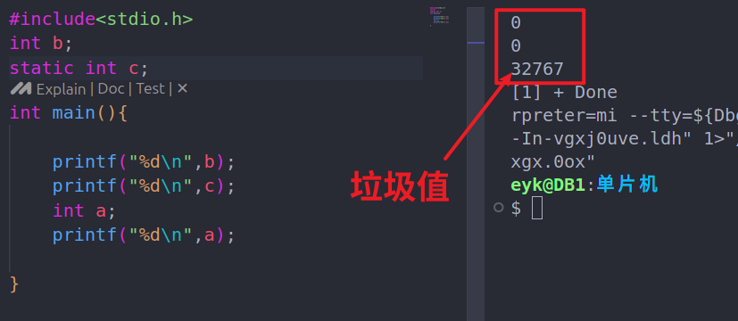
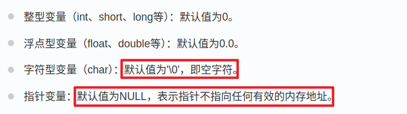
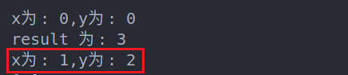

# 一、变量不初始化的模特
在 C 语言中，如果变量没有显式初始化，那么它的默认值将`取决于该变量的类型`和其`所在的作用域`。

## 1.默认值
对于`全局变量`和`静态变量`（在函数内部定义的静态变量和在函数外部定义的全局变量），它们的`默认初始值为零`。

对于`局部变量`，它们的`默认初始值是不确定的`。这意味着它们的值将是`之前在内存中存储的值`，或者是`随机的垃圾值`。

验证：


所以，使局部变量之前必须初始化。

## 2.各类型的初始值



# 二、变量声明
## 核心：除非有 extern 关键字，否则都是变量的定义。

## 1.普通声明-建立存储空间
例如：`int a `在声明的时候就已经建立了存储空间。

## 2.extern-外部引用
不需要建立存储空间的，通过使用`extern关键字声明变量名`而`不定义它`。

例如
```c
#include <stdio.h>

// 函数外定义变量 x 和 y
int x;
int y;
int addtwonum()
{
    // 函数内声明变量 x 和 y 为外部变量
    extern int x;
    extern int y;
    // 给外部变量（全局变量）x 和 y 赋值
    x = 1;
    y = 2;
    return x + y;
}

int main()
{
    printf("x为: %d,y为: %d\n", x, y);

    int result;
    // 调用函数 addtwonum
    result = addtwonum();
    printf("result 为: %d\n", result);
    printf("x为: %d,y为: %d\n", x, y);//外部变量的值从此改变了
    return 0;
}
```
结果：
