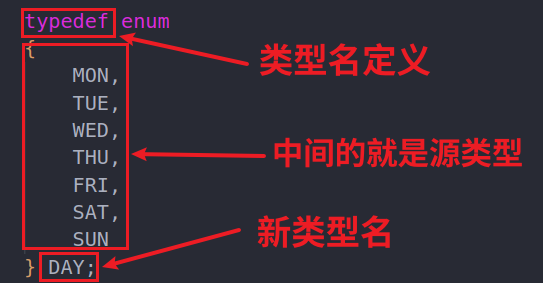

# 枚举的定义，只掌握typedef这一种就好了！

分析，注意


实际代码
```c
#include <stdio.h>
typedef enum//typedef是关键字，指定类型转换。中间的就是枚举的真正的结构了！
{
    MON,
    TUE,
    WED,
    THU,
    FRI,
    SAT,
    SUN
} DAY;//DAY代表的是枚举类型，这是一个新类型，不是变量
```

## 完整代码：

```c
#include <stdio.h>
typedef enum
{
    MON,
    TUE,
    WED,
    THU,
    FRI,
    SAT,
    SUN
} DAY;
int main()
{
    DAY day = THU;
    printf("%d\n", day);
    return 1;
}
```