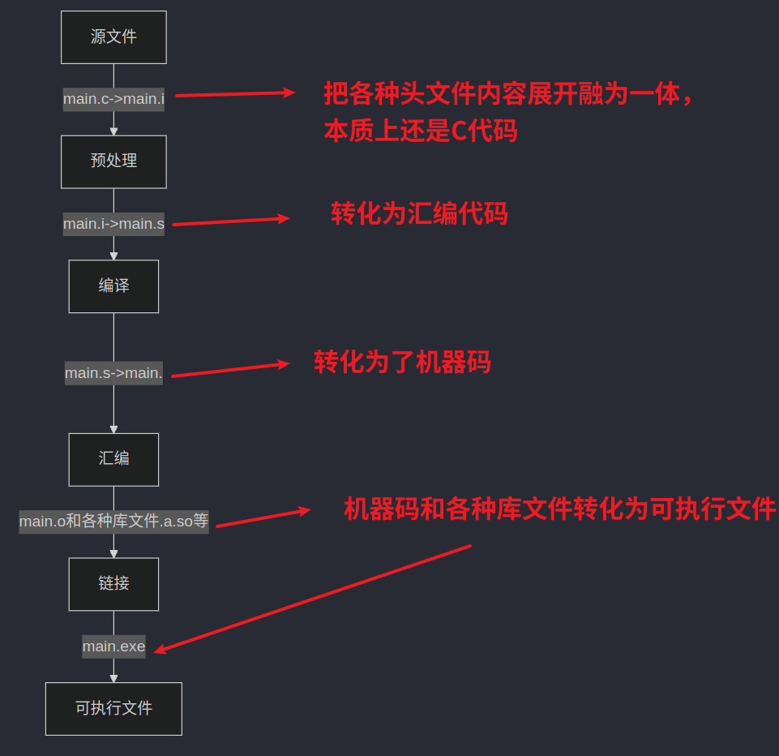
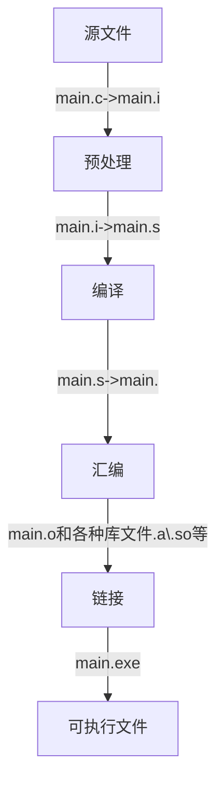

## 从源文件到可执行文件的过程-->共6大步

图解：

```mermaid
graph TB
A[源文件] --main.c->main.i--> B[预处理]
B --main.i->main.s--> C[编译]
C --main.s->main.o--> D[汇编]
D --main.o和各种库文件.a\.so等--> E[链接]
E --main.exe--> F[可执行文件]

```