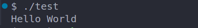
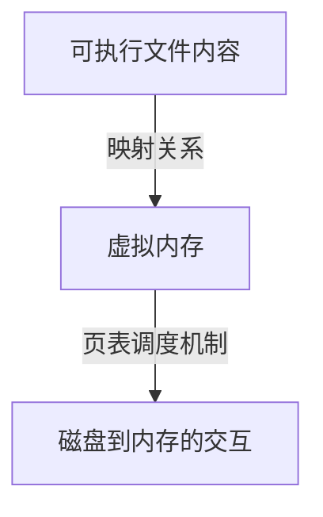

# 加载并执行命令
["加载过程>可执行问价-虚拟内存-物理内存"](https://www.doubao.com/thread/w93497fd4fdf4f377)

## 1.Shell 如何加载并执行命令

因为test不是一个内置的 shell 命令，所以 shell `会认为 prog 是一个可执行目标文件`，
通过调用某个驻留在存储器中称为`加载器(loader)的操作系统代码`来`运行它`。

---
## 2.加载核心-execve函数
任何Linux程序都可以通过`调用execve函数`来调用`加载器`。加载器将可执行目标文件中的`代码和数据从磁盘复制到内存中`，
然后通过`跳转到程序的第一条指令`或`入口点`来运行该程序。这个将程序复制到内存并运行的过程叫做加载。

---
## 3.加载器在本过程的虚拟内存机制
加载器的实际工作简介
### 1. 前置知识
  Linux系统中的`每个程序`都运行在一个`进程上下文`中，有自己单独的`虚拟地址空间`。

### 2. 页映射
  当shell 运行一个程序时，`父 shell 进程生成一个子进程`，它是父进程的`一个复制`。子进程通过execve 系统调用启动加载器。加载器`删除子进程现有的虚拟内存段`，并创建一组新的代码、数据、堆和栈段。新的栈和堆段被初始化为零。通过`将虚拟地址空间中的页`映射到`可执行文件的页大小的片`(chunk)，`新的代码和数据段被初始化为可执行文件的内容`。

### 3. 数据复制与执行
  最后，加载器跳转到 start地址，它最终会调用应用程序的 main 函数。除了一些头部信息，在加载过程中没有任何从磁盘到内存的数据复制。直到CPU引用一个被映射的虚拟页时才会进行复制，此时，`操作系统通过它的页面调度机制(页表查找)自动将页面从磁盘传送到内存`。

