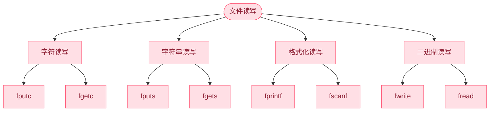

### 1.文件处理
介绍 C 程序员如何`创建`、`打开`、`读取`、`写入`、`关闭`文本文件或二进制文件。

### 2.打开(创建)文件
使用 `fopen( ) 函数`来`创建`一个新的文件或者`打开`一个已有的文件，这个调用会初始化类型 `FILE` 的一个对象，类型 FILE 包含了所有用来控制流的必要的信息。
```c
FILE *fopen( const char *filename, const char *mode );
```
在这里，filename 是字符串，用来`命名文件`，`访问模式` mode 的值可以是下列值中的一个：
| 模式 | 描述 |
| ---- | ---- |
| r | 打开一个`已有的文本文件`，允许`读取`文件。 |
| w | 打开一个文本文件，允许`写入`文件。`如果文件不存在，则会创建一个新文件`。在这里，程序会`从文件的开头写入内容`。如果文件存在，文件内容`会被清空`（即文件长度被截断为0）。 |
| a | 打开一个文本文件，以`追加模式`写入文件。如果文件不存在，`则会创建一个新文件`。在这里，程序会在已有的文件内容中追加内容。 |
| r+ | 打开一个文本文件，允许`读写`文件。 |
| w+ | 打开一个文本文件，允许`读写`文件。如果文件已存在，则文件会被截断为零长度，如果文件不存在，则会创建一个新文件。 |
| a+ | 打开一个文本文件，允许`读写`文件。如果文件不存在，则会创建一个新文件。读取会从文件的开头开始，写入则只能是追加模式。 | 

带 + 和不带 + 的主要区别在于是否`同时具备读写权限`


注意：
是二进制文件，则需使用下面的访问模式来取代上面的访问模式：
(本质就是在模式后面`加一个b`)
| 模式 | 描述 |
| ---- | ---- |
| rb | 打开一个`二进制文件`，允许`读取`文件。 |
| wb | 打开一个`二进制文件`，允许`写入`文件。`如果文件不存在，则会创建一个新文件`。在这里，程序会`从文件的开头写入内容`。如果文件存在，文件内容`会被清空`（即文件长度被截断为0）。 |
| ab | 打开一个`二进制文件`，以`追加模式`写入文件。如果文件不存在，`则会创建一个新文件`。在这里，程序会在已有的文件内容中追加内容。 |
| rb+ | 打开一个`二进制文件`，允许`读写`文件。 |
| wb+ | 打开一个`二进制文件`，允许`读写`文件。如果文件已存在，则文件会被截断为零长度，如果文件不存在，则会创建一个新文件。 |
| ab+ | 打开一个`二进制文件`，允许`读写`文件。如果文件不存在，则会创建一个新文件。读取会从文件的开头开始，写入则只能是追加模式。 |


### 3.文件写入
写系列，及printf系列和put系列
```c
int fputc( int c, FILE *fp );
int fputs( const char *s, FILE *fp );
int fprintf( FILE *fp, const char *format, ... );
int fwrite( const void *ptr, size_t size, size_t nmemb, FILE *stream );
```
`fputc` 函数把参数 `c` 的字符值写入到 `fp` 所指向的输出流中。
`fputs` 函数把字符串 `s` 写入到 `fp` 所指向的输出流中。
`fprintf` 函数把格式化后的字符串写入到 `fp` 所指向的输出流中。
`fwrite` 函数把 `ptr` 所指向的数组中的数据写入到给定流 `stream` 中。


### 4.文件读取


### 5.补充知识

| 比较项 | `NULL` | `'\0'` |
| --- | --- | --- |
| **定义与本质** | 是用于表示空指针的宏定义，通常在 `<stddef.h>` 中被定义为 `((void *)0)`，是指向空地址的指针 | 是字符常量，代表 ASCII 码值为 0 的字符，即空字符 |
| **使用场景** | 主要用于指针操作。函数返回指针失败或无有效结果时返回 `NULL`；使用指针前检查是否为 `NULL`，避免空指针解引用 | 主要用于字符串处理。字符串以 `'\0'` 作为结束标志，字符串操作函数依据它判断字符串长度和结束位置 |

```mermaid
flowchart TB
文件操作-->打开(创建)关闭-->fopen & fclose
文件操作-->文件读写
文件操作-->文件定位
文件操作-->文件报错

    文件读写--> 字符读写["字符读写"] & 字符串读写["字符串读写"] & 格式化读写["格式化读写"] & 二进制读写["二进制读写"]
    字符读写 --> fputc["fputc"] & fgetc["fgetc"]
    字符串读写 --> fputs["fputs"] & fgets["fgets"]
    格式化读写 --> fprintf["fprintf"] & fscanf["fscanf"]
    二进制读写 --> fwrite["fwrite"] & fread["fread"]

    文件定位-->移动文件指针-->fseek-->SEEK_CUR & SEEK_END & SEEK_SET
    文件定位-->返回文件指针位置 --> ftell
    文件定位-->文件置于开头-->rewind
    


    文件报错-->ferror & feof
```


