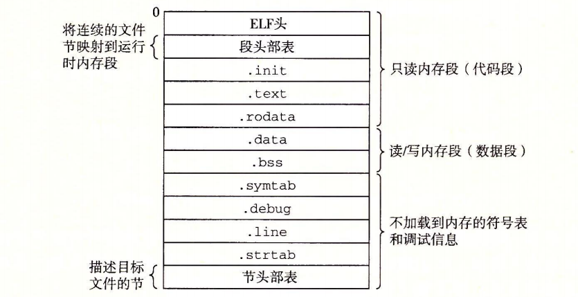

# 一、一图讲解 Linux 的内存映射
本质：讲解`可执行文件`的`结构`及其加载、执行过程

# 二、可执行文件的结构
### 1.基本共识及图示
目标文件纯粹是`字节块的集合`

结构图示：

----
### 2.与重定位目标文件的区别
#### 2.1.多了程序入口点
  可执行文件包括程序的入口点(entry point)，也就是当程序运行时要`执行的第一条指令的地址`。

#### 2.2.各个节已经被重定位到最终运行时内存地址
  .text、.rodata和.data节与可重定位目标文件中的节是相似的，除了`这些节已经被重定位到它们最终的运行时内存地址`以外。

#### 2.3.不再需要重定位信息
  因为`可执行文件是完全链接的(已被重定位)`，所以它不再需要rel 节。

---
### 3.程序映射
可执行文件被设计得`很容易加载到内存`，可执行文件的连续的`片(chunk)被映射到连续的内存段`。`程序头部表`描述了这种映射关系。可由`OBJDUMP`显示之

