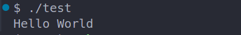

# 加载并执行命令
## 1.Shell 如何加载并执行命令

因为test不是一个内置的 shell 命令，所以 shell `会认为 prog 是一个可执行目标文件`，
通过调用某个驻留在存储器中称为`加载器(loader)的操作系统代码`来`运行它`。

## 2.加载核心-execve函数
任何Linux程序都可以通过`调用execve函数`来调用`加载器`。加载器将可执行目标文件中的`代码和数据从磁盘复制到内存中`，
然后通过`跳转到程序的第一条指令`或`入口点`来运行该程序。这个将程序复制到内存并运行的过程叫做加载。

