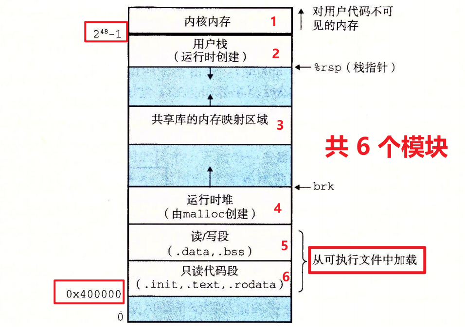

## 一、程序映射
可执行文件被设计得`很容易加载到内存`，可执行文件的`连续的片(chunk)`被映射到`连续的内存段`。`程序头部表`描述了这种映射关系。可由OBJDUMP显示的之

## 二、内存映像
每个 Linux程序都`会被操作系统映射成一个运行时虚拟内存映像`，如图所示。

从下到上共6个模块，地址也依次增加：

["详细细节请看文件"](../2.可执行目标文件内存映射/test/分析ELF各个段的内容.txt)

---
### (一)只读代码段——字符串等！

#### 1..text段
  已编译程序的`机器码`

#### 2..init段
  .init 段主要存放的是程序`启动时`需要`执行的初始化代码`。

  在进入 main 函数之前，系统会先执行 .init 段中的代码，其目的在于完成一些`必要的、提前的初始化`操作。 比如：`全局变量初始化`、运行环境准备

#### 3..rodata段
  `只读数据`，比如`printf、puts`里面的格式字符串

---
### (二)读写段(数据段)——全局、静态变量

#### 1. .data
  `已初始化`的`全局和静态`C变量

#### 2..bss
  `未初始化`的`全局和静态`C变量

---
### (三)堆
 由程序员分配释放，内存中的最大可分配区域，供程序运行时动态分配内存。调用函数malloc()\free()

---
### (四)共享库内存映射区域
 共享库映射加载的区域

---
### (五)栈
 由编译器`自动分配释放`，存放`局部变量、形参、返回值`。如函数里面的局部变量等。

---
### (六)OS内核
 `操作系统常驻内存的部分`，`简化程序`调用操作系统的开销。