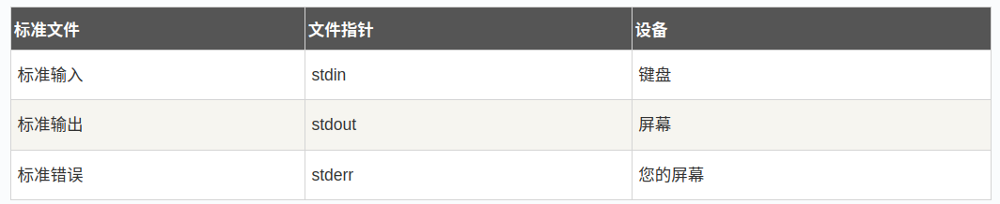

# 一、标准文件
C 语言`把所有的设备都当作文件`。所以设备（比如显示器）被处理的方式与文件相同。

unix哲学：`一切皆文件！`

# 二、自动打开的三个文件
以下三个文件会在程序执行时自动打开，以便访问键盘和屏幕。
* 标准输入文件（stdin）：stdin的文件描述符为`0`，通常是键盘。
* 标准输出文件（stdout）：stdout 的文件描述符为`1`，通常是显示屏。
* 标准错误文件（stderr）：stderr 的文件描述符为`2`，通常是用同是显示屏。

