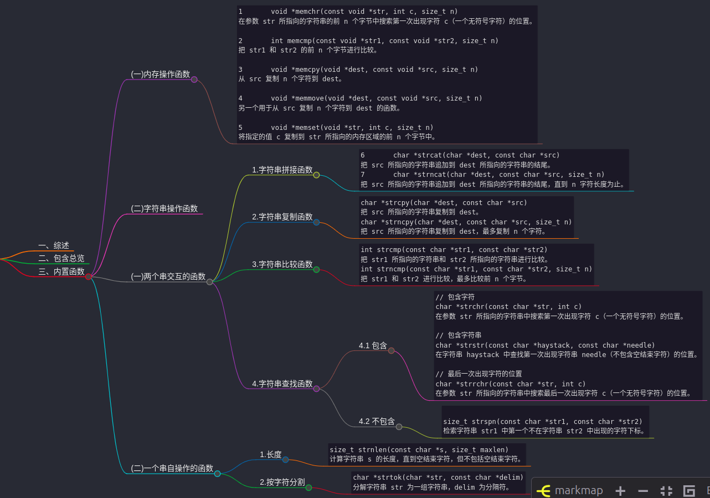

# 一、综述
string.h 是 C 标准库中的一个头文件，提供了一组用于`处理字符串`和`内存块`的函数。这些函数涵盖了字符串`复制`、`连接`、`比较`、`搜索`和`内存操作`等。


# 二、包含总览
一个`变量类型(size_t)`、一个`宏(NULL表明空指针的值)`和各种`操作字符数组`的函数。

# 三、内置函数

## (一)内存操作函数
```c
1	void *memchr(const void *str, int c, size_t n)
在参数 str 所指向的字符串的前 n 个字节中搜索第一次出现字符 c（一个无符号字符）的位置。

2	int memcmp(const void *str1, const void *str2, size_t n)
把 str1 和 str2 的前 n 个字节进行比较。

3	void *memcpy(void *dest, const void *src, size_t n)
从 src 复制 n 个字符到 dest。

4	void *memmove(void *dest, const void *src, size_t n)
另一个用于从 src 复制 n 个字符到 dest 的函数。

5	void *memset(void *str, int c, size_t n)
将指定的值 c 复制到 str 所指向的内存区域的前 n 个字节中。
```

## (二)字符串操作函数

## (一)两个串交互的函数

### 1.字符串拼接函数
```c
6	char *strcat(char *dest, const char *src)
把 src 所指向的字符串追加到 dest 所指向的字符串的结尾。
7	char *strncat(char *dest, const char *src, size_t n)
把 src 所指向的字符串追加到 dest 所指向的字符串的结尾，直到 n 字符长度为止。
```

### 2.字符串复制函数
```c
char *strcpy(char *dest, const char *src)
把 src 所指向的字符串复制到 dest。
char *strncpy(char *dest, const char *src, size_t n)
把 src 所指向的字符串复制到 dest，最多复制 n 个字符。
```

### 3.字符串比较函数
```c
int strcmp(const char *str1, const char *str2)
把 str1 所指向的字符串和 str2 所指向的字符串进行比较。
int strncmp(const char *str1, const char *str2, size_t n)
把 str1 和 str2 进行比较，最多比较前 n 个字节。
```

### 4.字符串查找函数

#### 4.1 查找在
```c
// 包含字符(这个和memchr很相似，但是用这个好一点，因为是专属的！)
char *strchr(const char *str, int c)
在参数 str 所指向的字符串中搜索第一次出现字符 c（一个无符号字符）的位置。

// 包含字符串
char *strstr(const char *haystack, const char *needle)
在字符串 haystack 中查找第一次出现字符串 needle（不包含空结束字符）的位置。

// 最后一次出现字符的位置
char *strrchr(const char *str, int c)
在参数 str 所指向的字符串中搜索最后一次出现字符 c（一个无符号字符）的位置。
```

#### 4.2 查找不在
```c

size_t strspn(const char *str1, const char *str2)
检索字符串 str1 中第一个不在字符串 str2 中出现的字符下标。
```

## (二)一个串自操作的函数
#### 1.长度
```c
size_t strnlen(const char *s, size_t maxlen)
计算字符串 s 的长度，直到空结束字符，但不包括空结束字符。
```

#### 2.按字符分割
```c
char *strtok(char *str, const char *delim)
分解字符串 str 为一组字符串，delim 为分隔符。
```
